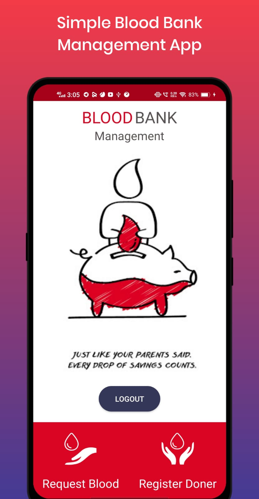
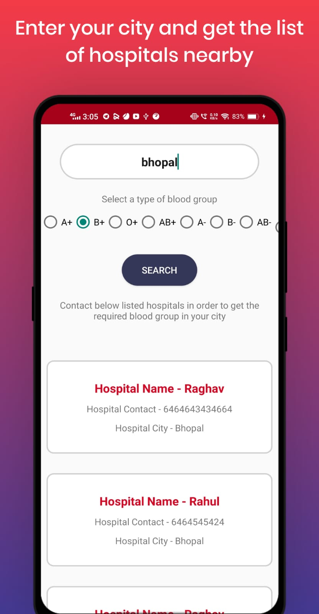
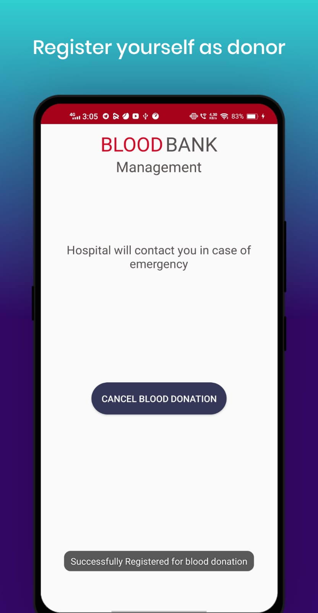

# BloodBankMangementApp

This app is a simple blood bank management app which allows individual user to register themselves as blood donors or allows
them to search nearby hospitals if they require blood.

# App Screenshots

  

# Features of the app
- This app has no ads and do not contains any in app purchases and is totally free. So if you want you can give it a try.
- Search the name of the city in the <b>search box</b>.
- Become a blood donor 

# Backend (Firebase)

- **Firebase is a Backend-as-a-Service (Baas).**
- It provides developers with a variety of tools and services to help them develop quality apps, grow their user base, and earn profit. It is built on Google’s infrastructure.
- Firebase is categorized as a NoSQL database program, which stores data in JSON-like documents.

# Configure Firebase 👀
- Create your own project on firebase. 
- download google-services.json 
- Place it in the app folder
- Setup Realtime database in firebase and enable the database by setting true to read & write in the rules tab of relatime database.
- Setup Storage in firebase and enable it by setting true to read and write in the rules of storage. 
- Setup authentication in firebase and enable email/password authentication.
- You are good to go.👌👌

# License
Licensed under the [Apache Licence 2.0](LICENSE).
